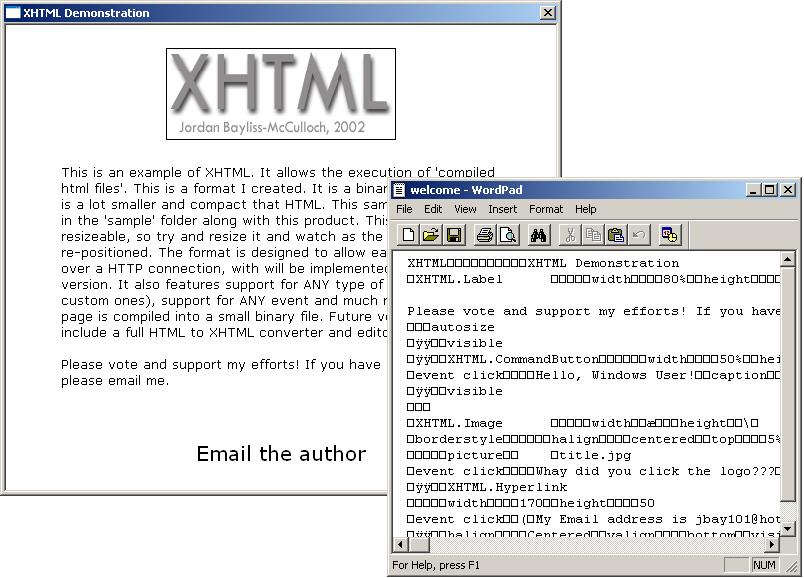



## XHTML \- A GUI binary compiler and viewer with events

### Description

This is a complete GUI compiler and interpreter with support for events. I aimed to make a format for the internet that could be streamed and would be small yet powerful. HTML is a large language - so I wanted to make a binary language that would be able to do anything HTML could do..the result - XHTML. This demonstrates advanced techniques to dynamicly create ANY control at runtime, an object class event handler, calling and setting object properties by name and much more. Also demonstrates the basics of a streamed language. Currently, there is no scripting support or dialog editor, but this will be added next. I wanted to create an extremely powerful language - both fast and compact. This project is still under development, and I am aiming to create something similar to a Windows Java like program...of course, I must add a launguage first. I have included a VERY basic sample, showing off a label (text), hyperlink and image. Without modifying the code, the sample could create anything - from a combo box to a commondialog control to a text box. If you don't like it, please tell me why so I can improved it. Anyone is welcome to use this code in their projects (a mention would be nice). I have worked hard on this, and all feedback would be GREAT!

As always, If you think this is good code (or at least OK), *please* leave a comment and vote!
 
### More Info
 

             |
---                |---
**Submitted On**   |2002-11-08 16:30:48
**By**             |[jbay101](https://github.com/Planet-Source-Code/PSCIndex/blob/master/ByAuthor/jbay101.md)
**Level**          |Intermediate
**User Rating**    |5.0 (30 globes from 6 users)
**Compatibility**  |VB 5\.0, VB 6\.0
**Category**       |[Complete Applications](https://github.com/Planet-Source-Code/PSCIndex/blob/master/ByCategory/complete-applications__1-27.md)
**World**          |[Visual Basic](https://github.com/Planet-Source-Code/PSCIndex/blob/master/ByWorld/visual-basic.md)
**Archive File**   |[XHTML\_\-\_A\_1494061182002\.zip](https://github.com/Planet-Source-Code/jbay101-xhtml-a-gui-binary-compiler-and-viewer-with-events__1-40535/archive/master.zip)

